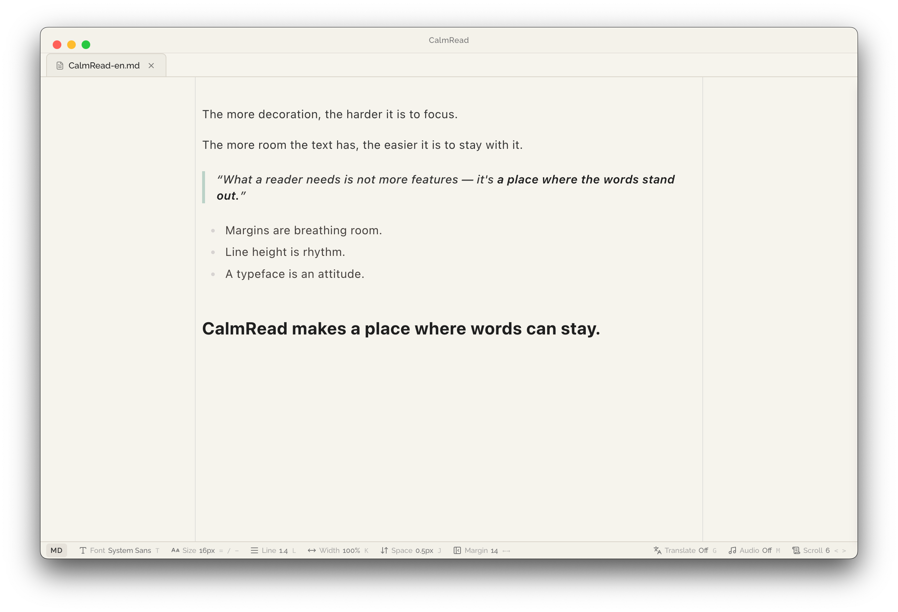
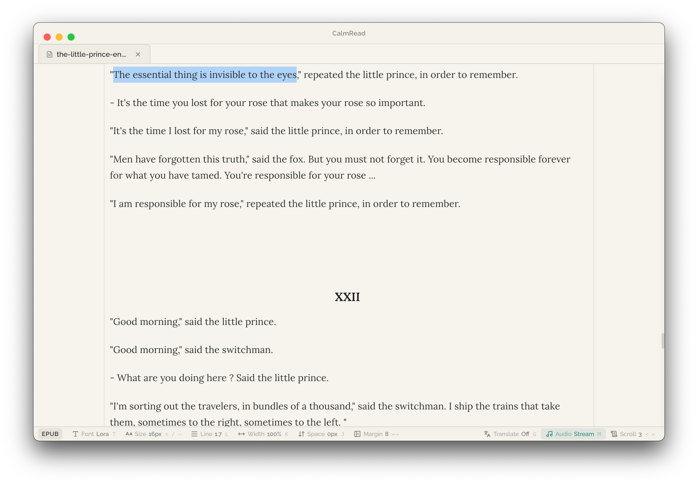
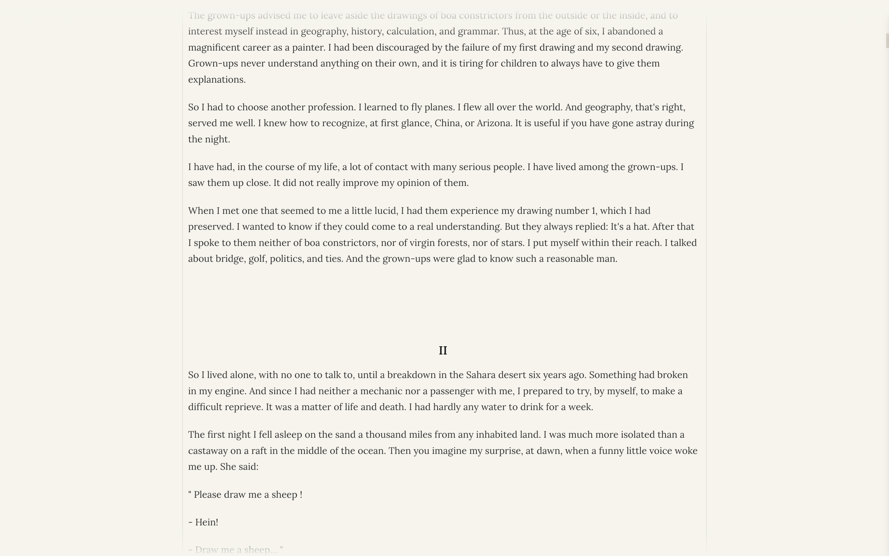
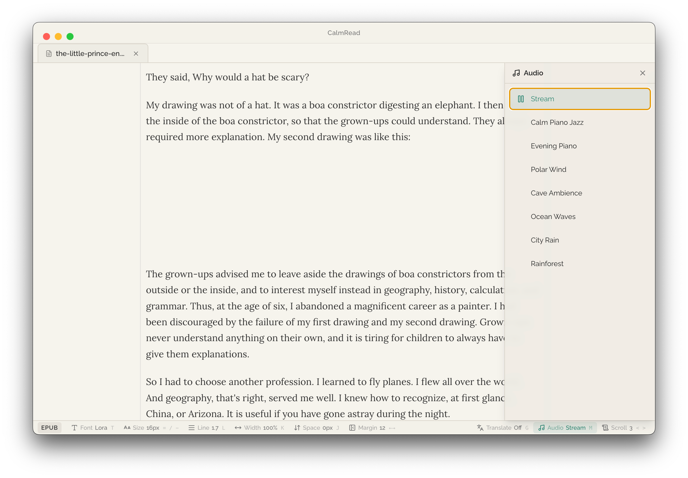

# CalmRead

> Read without distractions.



A calm, focused document reader for TXT, Markdown, EPUB, DOCX, and CSV. Designed to help you read in long, steady breaths — not quick scrolls.

## Features

- **Focus Mode** — Hide all UI. Just you and the text
- **Ambient Sounds** — 9 curated soundtracks for deep reading
- **Custom Typography** — Fine-tune fonts, line height, letter spacing, and margins
- **Real-time Translation** — Read in 12 languages
- **Multi-format** — TXT, Markdown, EPUB, DOCX, CSV, HTML in one interface
- **Bookmarks** — Save your reading position and pick up where you left off

## Install

```bash
brew install --cask calmread-app/tap/calmread
```

## Update

```bash
brew upgrade --cask calmread
```

## Uninstall

```bash
brew uninstall --cask calmread
```

## Screenshots

| Reading | Calm Mode | Ambient Sounds |
|---------|-----------|----------------|
|  |  |  |

## Links

- [Website](https://calmread.app)
- [GitHub](https://github.com/calmread-app/CalmRead)
- [Releases](https://github.com/calmread-app/CalmRead/releases)

---

Made by [raccoony](https://raccoony.dev)
